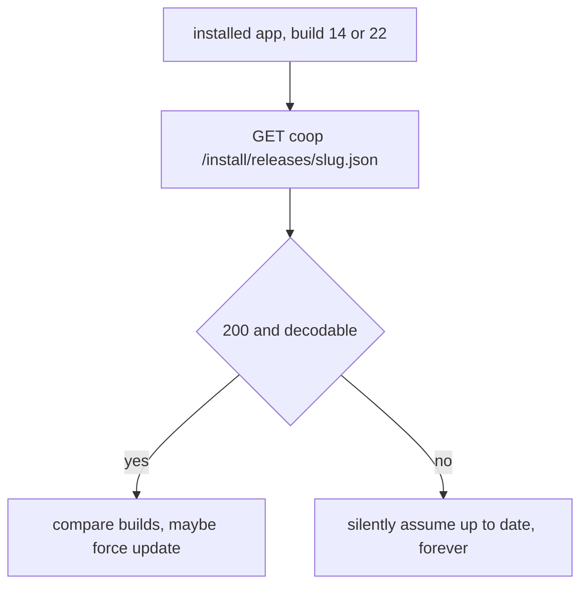
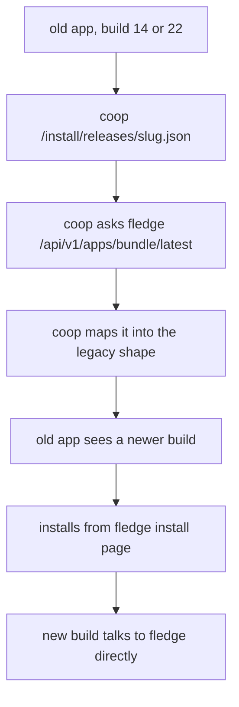
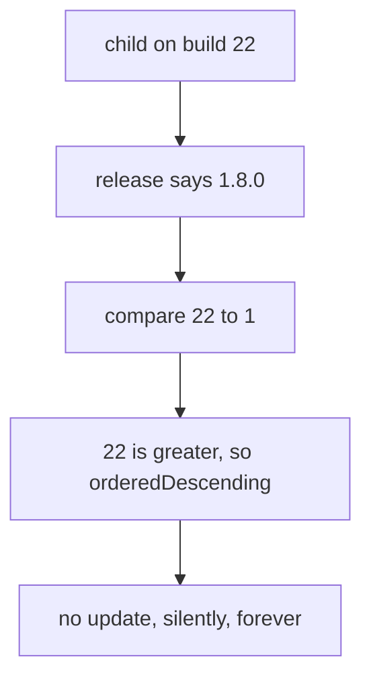

# Retire Coop's install portal, move OTA to Fledge

Working plan, not committed intent.
Comment inline; anything you strike gets reworked before a single file changes.

## What we are actually doing

Four things got braided together, and they have different risk profiles.
Keeping them separate is most of the plan.

1. Delete `/install/` and the `coop-coop-ota` PVC from Coop.
2. Move version checking and OTA hosting to Fledge.
3. Show every family device's app version in the parent app.
4. Put releases behind Quill in GitHub Actions.

Only #1 is dangerous, and only because of devices already in the wild.

## The constraint everything bends around

Installed apps poll `GET /install/releases/{parent,child}.json` on Coop and compare builds client-side.
Per ADR 0016 that check **fails open**: a non-200, a throw, or an undecodable body all mean "no update", silently, with no error surfaced anywhere in the UI.

So deleting `/install/` does not break the apps.
It does something worse.
It permanently removes our only channel for telling them to update, and they will sit on parent 14 / child 22 forever with no symptom.

There is no rollback for that, because the fix would have to be delivered through the channel we just deleted.



There is a second trap in the same area.
`internal/webapp/webapp.go:25` excludes `/install/` from the SPA catch-all.
Delete the routes but leave that exclusion and the path starts serving `index.html` with **status 200**, not 404, so the failure moves from the status check to the decode path.
Same outcome, harder to spot.

## Blocker: live Fledge cannot do this yet

| | version |
| --- | --- |
| running on mini-1 | `0.1.1` |
| last pushed flux commit | `0.1.1` |
| unpushed commit `c5da261` | `0.3.0` plus the public hostname |
| uncommitted working tree | `0.4.1` plus `FLEDGE_KEEP_BUILDS=5` |
| released | `v1.0.0` |

`GET /api/v1/apps/{bundle}/latest` first appears in **0.4.1** (commit `b62dbe0`).
On the running `0.1.1` it returns Go's default `404 page not found` rather than Fledge's own `{"error":"not found"}`, which confirms the route does not exist rather than the app being absent.

Joey is upgrading this now.
Nothing below can be verified until it lands, and the flux repo needs its unpushed commit and dirty tree resolved in the same pass.

Per the Fledge runbook: bump the image in the flux manifest and `kubectl apply`, never `kubectl set image`.

## Phase 0: Fledge current, flux clean

**Done.**
Live image is `ghcr.io/theoutdoorprogrammer/fledge:1.0.0` and `GET /api/v1/apps/fish.nerdswhofish.coop.parent/latest` now returns Fledge's own `{"error":"not found"}` rather than Go's default `404 page not found`, which is the route existing with nothing published against it yet.

The flux repo is clean as well: nothing unpushed, no uncommitted edits, and the committed image matches what is running.
The earlier `0.1.1` live / `0.4.1` uncommitted split is resolved.

## Phase 1: Publish the existing builds to Fledge

**Done.**

The already-signed IPAs were lifted straight off the `coop-coop-ota` PVC and uploaded unchanged, rather than rebuilt from source.
Rebuilding would have produced different artifacts with fresh signatures for no reason; the point of this phase is that Fledge serves the **byte-identical** builds devices already trust, so nothing observable changes at cutover.
No Xcode, no keychain, and no signing certificate were involved.

Method, for the record: a short-lived operator pod mounted the claim read-only (the pattern `deploy/ota/README.md` already documents), uploaded both archives to `POST /api/builds` over the LAN hostname, and was deleted.
The upload token came from the `fledge` Kubernetes secret rather than 1Password.

| | parent | child |
| --- | --- | --- |
| bundle | `fish.nerdswhofish.coop.parent` | `fish.nerdswhofish.coop.child` |
| build | `14` | `22` |
| build id | `570fdeca6768` | `e8fba2b4c97b` |
| size | 4,279,444 | 5,053,412 |

Verified after upload:

- Sidecar and `CFBundleVersion` agree, so the cutover does not move the number. Coop's `.version` files said 14 and 22, and Fledge independently read 14 and 22 out of the archives.
- `?build=22` returns `update_available: false` and `?build=21` returns `true`, so the query parameter behaves.
- Profiles are ad hoc, 7 devices, `expired: false`, expiring 2027-08-16.
- `install_page_url` uses the **public** hostname, and both install pages plus both API endpoints return 200 through Cloudflare.

Both apps report `version: 0.1.0`, which is the stale `MARKETING_VERSION` the unified versioning below replaces.

One property to preserve in every later phase: `compareBuilds` (`AppUpdate.swift:63-77`) returns `.orderedSame` if **either** side has a non-integer component, so a non-numeric build silently turns the whole update check into a no-op.
Build values must stay dot-separated integers.

## Phase 2: The bridge release

This is the release that makes the PVC deletable while keeping every existing device reachable.

Coop keeps `GET /install/releases/{parent,child}.json` at the exact same path with the exact same response shape, but stops reading disk and starts asking Fledge.



Field mapping:

| legacy field | comes from |
| --- | --- |
| `build` | Fledge `build` |
| `installUrl` | itms URL built from Fledge's `/a/{bundle}/{build_id}/manifest.plist` |
| `installerUrl` | Fledge `install_page_url` |
| `app`, `title` | unchanged constants |

What gets deleted in this same release, because nothing reads disk any more:

- `/install/manifests/`, `/install/apps/`, and the embedded HTML index and CSS
- the `[ota]` config block, `ota.enabled` / `ota.directory`
- the chart's `ota-pvc.yaml`, the volume mount, and the `ota` values block
- `deploy/ota/` and its `.env`

`/install/` itself becomes a redirect to Fledge's install page for the duration of the bridge, so a cached or bookmarked link still lands somewhere useful.

New config replacing `[ota]`:

```toml
[updates]
enabled = true
base_url = "https://fledge.theoutdoorprogrammer.com"
parent_bundle_id = "fish.nerdswhofish.coop.parent"
child_bundle_id = "fish.nerdswhofish.coop.child"
```

Notes on the proxy itself: cache the Fledge response briefly in-process, and on a Fledge error return the last good answer or 404 rather than a malformed body.
Coop's endpoint must stay `no-store`.
Fledge being down must not turn into a forced-update loop.

### The percent-encoding question

Coop percent-encodes the manifest URL inside the itms URL (`internal/ota/handler.go:142`, `url.QueryEscape`).
Fledge deliberately does not, and carries a comment saying encoding silently kills the install (`internal/manifest/manifest.go:128`).

Both are in production, so one of those beliefs is wrong.
Coop's encoded form is the one that demonstrably installed builds 14 and 22, so the bridge keeps Coop's encoding.
Worth settling properly, but it is not a blocker and I am not guessing at it in code.

## Phase 3: Fledge-native clients

`AppUpdate.requiredRelease` currently derives the release URL by stripping `/api/v1` off the configured server address (`AppUpdate.swift:40-53`).
That trick dies the moment the release lives on a different origin, and it is the only real coupling in the iOS codebase: one function, one file, two call sites.

**The apps must not hardcode a Fledge hostname.**
Coop should hand them the update config at setup, so Fledge can move without rebuilding two apps, and so a self-hoster can point at their own Fledge or turn it off.

Add to Coop's existing setup/config response:

```json
{ "updates": { "baseUrl": "...", "parentBundleId": "...", "childBundleId": "..." } }
```

Then `requiredRelease` takes a base URL and bundle id instead of deriving them, decodes Fledge's `latest` shape, and keeps its own numeric comparison.

Do **not** trust Fledge's `update_available`: it is plain string inequality against the newest *upload* (`appapi.go:67`), so a re-upload of an older archive reads as an update, and it is `false` entirely if `?build=` is omitted.
The client's existing `compareBuilds` is stricter and stays.

Two known weaknesses to fix while we are in here, both pre-existing:

- HTTPS-only validation currently rides along via `ServerURL.normalize` and stops applying once the update URL bypasses it.
- Validation throws are swallowed by empty catches (`AppModel.swift:164-166`, `ChildAppModel.swift:131-133`), so a bad address is indistinguishable from "up to date".

Test coverage today is `compareBuilds` only (20 lines), nothing touches URL construction or the network, so **CI would give zero signal on any of this**.
That gap gets closed as part of the phase, not after it.

Fledge has no per-audience or required-build concept, and neither did Coop, because "required" was always client-side comparison.
Not a regression, but nobody should think Fledge added it.

## Phase 4: Version roster in the parent app

Independent of the migration, but it is the thing that makes Phase 5 safe instead of a guess.

Schema. Both tables already carry `last_seen_at`, so this hangs off machinery that already runs on every authenticated request:

```sql
ALTER TABLE child_device   ADD COLUMN app_build TEXT, ADD COLUMN app_version TEXT;
ALTER TABLE parent_session ADD COLUMN app_build TEXT, ADD COLUMN app_version TEXT;
```

Reporting: clients send `X-Coop-Client-Build` and `X-Coop-Client-Version` on every authenticated request via a CoopKit `ClientMiddleware`, and the auth middleware feeds them into the existing `TouchSession` / `TouchDevice` calls (`internal/store/accounts.go:539,925`).
No new endpoint, no heartbeat, one extra column write on a query that already runs.

Reading: a new `GET /api/v1/parent/devices` returning the whole family, parent sessions and child devices together, each with audience, owner, device name, app build and version, last seen, and whether it is the calling device.
`parent_session` is per sign-in, so a parent on two devices correctly shows two rows, which is what "my own included" needs.

`deviceDTO` gains the same two fields, since the existing per-child devices screen may as well show them.

## Phase 5: Delete the bridge

Gated on the roster showing nothing on a pre-Fledge build.
That is the whole point of Phase 4: this becomes an observation rather than a hope.

Removes `/install/` entirely, the `/install/` exclusions in `internal/webapp/webapp.go:25` and `internal/api/middleware.go:61`, and the legacy proxy.
Then delete the PVC.

The PVC holds four regenerable files and nothing else, and by this point Fledge has been serving the same builds for a good while, so it is not primary data.
Deleting it is still last, because it costs nothing to wait and there is no undo.

## Phase 6: Quill releases

You picked GitHub-hosted macOS runners, which is an explicit reversal of ADR 0013's "keep signing on the trusted macOS build machine".
That gets a **new ADR** superseding it, with the trust-boundary change stated plainly: the Apple Distribution cert and both Ad Hoc profiles move into GitHub secrets.
ADR 0013 stays as written.

Fledge authorization, from the runbook: two entries, one per bundle, bundle named explicitly and never `*`, and the ref constraint kept so a fork's PR cannot publish.

```console
joey vault set "fledge oidc policy" "$(joey vault get 'fledge oidc policy')
NerdsWhoFish/coop@refs/heads/main=fish.nerdswhofish.coop.parent
NerdsWhoFish/coop@refs/heads/main=fish.nerdswhofish.coop.child"
cd ~/projects/src/github.com/TheOutdoorProgrammer/flux && ./scripts/fledge-secret.sh
kubectl -n fledge rollout restart deploy/fledge
```

With OIDC there is no `FLEDGE_TOKEN` secret at all, because the job just needs `id-token: write`.

### One version for everything

Decided: server, parent and child all carry the same version, cut from one tag, republished even when nothing changed.
Server is at `v1.7.0` today (chart `version` and `appVersion` agree), so the first unified release is **`v1.8.0`**.

**The version string itself cannot be the iOS build number.**
Update is shown iff `compareBuilds(currentBuild, release.build) == .orderedAscending`, and `compareBuilds` compares dot-separated integers positionally.
A child on build `22` against a release of `1.8.0` compares `[22]` to `[1, 8, 0]`, sees `22 > 1`, and concludes it is newer:



It does not even fail safe.
`compareBuilds` returns `.orderedSame` when a component is non-integer, but every component of `1.8.0` is an integer, so it does not bail out, it compares wrongly and confidently.

So the tag drives two derived fields instead of one:

| Xcode setting | value | audience |
| --- | --- | --- |
| `MARKETING_VERSION` | `1.8.0`, identical to server and chart | humans |
| `CURRENT_PROJECT_VERSION` | `10800`, derived `major * 10000 + minor * 100 + patch` | iOS and the update check |

One tag, nothing hand-maintained, no counter to drift.
`1.8.0` is `10800`, `1.8.1` is `10801`, `2.0.0` is `20000`: monotonic with semver, reversible by eye, and safely above the existing 14 and 22 for any version we would ever cut.

Both apps currently declare `MARKETING_VERSION = 0.1.0`, which is simply wrong and gets fixed by the same change.

From Phase 3 onward the clients compare Fledge's `version` field, so the encoded build number stops mattering to anything except iOS itself.

### Still open: one workflow or two

Quill cuts one tag and publishes in a fixed order (goreleaser, then fledge, then docker).
With a unified version a single `release.yml` doing `publish: docker, fledge` is now coherent, where before it was not.

The remaining question is whether a server-only patch should really trigger a macOS runner, an archive of both apps, and two Fledge uploads.
Joey's "push new versions even if nothing changed" suggests yes, and one workflow is simpler, so that is the default unless he says otherwise.

## Unrelated things found on the way

- `fledge.theoutdoorprogrammer.com` reaches the k8s Service through the Cloudflare tunnel, bypassing Traefik entirely, which is why the IngressRoute only matches `fledge.stout.zone`. Not a bug, but non-obvious.
- `coop.stout.zone` resolves to `192.168.229.74` even on `1.1.1.1`. The install portal is LAN-only today, so **the kids can currently only update at home**. Moving to Fledge fixes that as a side effect.
- Fledge's index lists every app on the server, so Coop's builds will appear next to Haystack's. Coop's `/install/` was a curated two-app page with a strict CSP; there is no scoped equivalent. Cosmetic, but it is a real loss.
- Fledge sets no CSP on any HTML page and no CORS headers anywhere, so `/latest` is not callable from a browser page on another origin. Fine for native apps; would matter if the web client ever needed it.

## Docs and catalog

ADRs 0010, 0013, 0016 and 0018 all describe the old arrangement.
None get rewritten, because a new ADR supersedes, per the usual rule.

`service:stout/coop` in Dusk still says the installer is "enabled at `https://coop.stout.zone/install/`" and describes IPAs living on the workload's persistent volume.
That description and the OTA runbook both need updating once Phase 5 lands.
