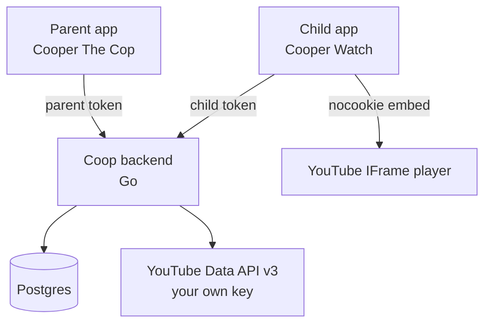

# Coop

Self-hosted, parent-curated YouTube for kids.

Children get an app that looks and feels like real YouTube: a home feed, subscriptions, channel pages, search, and a vertically scrolling Shorts feed.
Every channel they can watch was approved by a parent first.
When they find something new, they ask, and a parent approves it from their own app.

No Google account on the child's device. No comments, in either direction. No livestreams.

> **Status: pre-alpha.** The backend builds, migrates, serves, and keeps approved channels ingested.
> Phase 2 is complete: the parent app handles setup, secure sessions, children and devices, requests, content policy, suppression audits, channel discovery, family settings, and scoped parent invitations.
>
> **Picking this up?** Start with [docs/HANDOFF.md](docs/HANDOFF.md): where things stand, the
> invariants worth not breaking, and what to build next. The full design is in
> [docs/PLAN.md](docs/PLAN.md), and the reasoning behind the big calls in [adr/](adr/).

## How it works



Each family runs their own backend with their own YouTube Data API key.
The backend holds the allowlists, evaluates policy, and caches everything it fetches.
Playback uses YouTube's official embedded player, so creators receive real views and there is no stream extraction involved.

## Features

- **Channel-level allowlists**, global across the family or per child.
- **Three channel states**: allowed, requestable (visible, asks first), and blocked (invisible).
- **Request and approve loop.** A child asks, a parent approves from their phone.
- **Negative keywords** that block individual videos inside otherwise-allowed channels, with every suppression visible to the parent and overridable in one tap.
- **Multiple children**, each with their own subscriptions, allowlist, and settings.
- **Multiple parents**, scoped to the children they are allowed to manage.
- **Local subscriptions, likes, and dislikes** that never touch YouTube.
- **No livestreams**, including finished livestream VODs.
- **Child search across channels and videos**, with blocked results hidden and requestable videos locked behind approval.
- **Parent-tunable recommendations** over the approved pool, ranked entirely from cached data.

## Components

| Path | What |
| --- | --- |
| `cmd/coopd` | The backend server binary |
| `internal/config` | Configuration loading, TOML file overlaid by environment |
| `internal/store` | Postgres models and migrations |
| `internal/policy` | Allowlist and keyword evaluation. Pure, no I/O |
| `internal/youtube` | Data API client, response cache, quota budgets |
| `internal/youtubeclient` | Family-scoped YouTube client construction |
| `internal/ingest` | Scheduled approved-channel catalog refresh |
| `internal/cleanup` | Daily expiry and ledger cleanup |
| `internal/rank` | Recommendation scoring. Pure, no I/O |
| `api/openapi.yaml` | The API contract, source of truth for both clients |
| `ios/CoopKit` | Generated Swift API client and shared native code |
| `ios/CooperTheCop` | SwiftUI parent app and XcodeGen project source |
| `adr/` | Architecture decision records |
| `docs/PLAN.md` | Full design document |

The parent app (`Cooper The Cop`) is complete through Phase 2.
The child app (`Cooper Watch`) lands in Phases 3 and 4.

## Requirements

- Go 1.26 or newer
- Postgres 16 or newer
- A Google Cloud project with the YouTube Data API v3 enabled, and an API key
- Xcode 16 or newer and XcodeGen 2.46 or newer for the parent app

Every family needs their own API key.
The YouTube API Developer Policies forbid embedding API credentials in open source projects, so there is no shared key and there never will be.
The upside is that each family gets its own full daily quota.

## Development

```sh
make help          # list targets
make dev-db        # start a local Postgres in Docker
make migrate       # apply migrations
make run           # run the server
make test          # run tests
make lint          # vet and staticcheck
```

The shared Swift package and parent app can be checked independently:

```sh
swift test --package-path ios/CoopKit
xcodegen generate --spec ios/CooperTheCop/project.yml
xcodebuild -project ios/CooperTheCop/CooperTheCop.xcodeproj \
  -scheme CooperTheCop -destination 'generic/platform=iOS Simulator' build \
  CODE_SIGNING_ALLOWED=NO
```

## Contributing

Decisions with real trade-offs get an ADR in [adr/](adr/) before the code lands.
Prose in this repo is written one sentence per line, so that editing a sentence produces a one-line diff.

## License

MIT. See [LICENSE](LICENSE).
