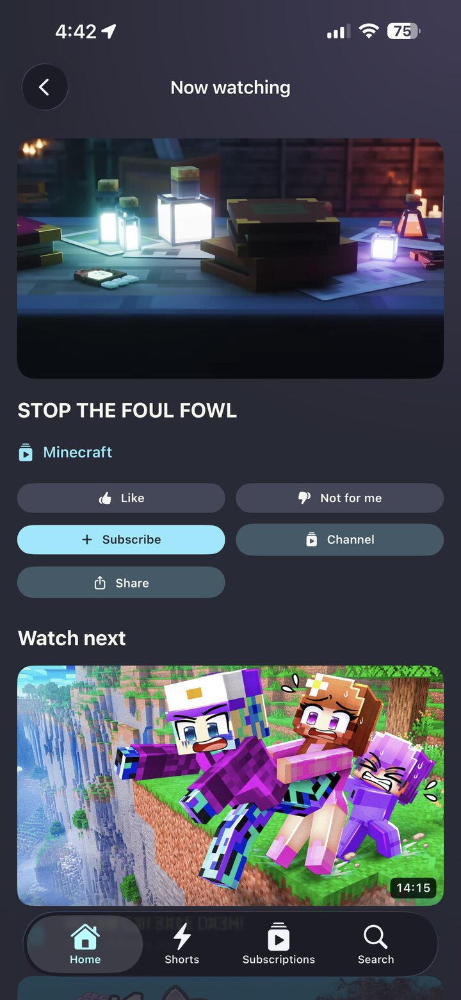
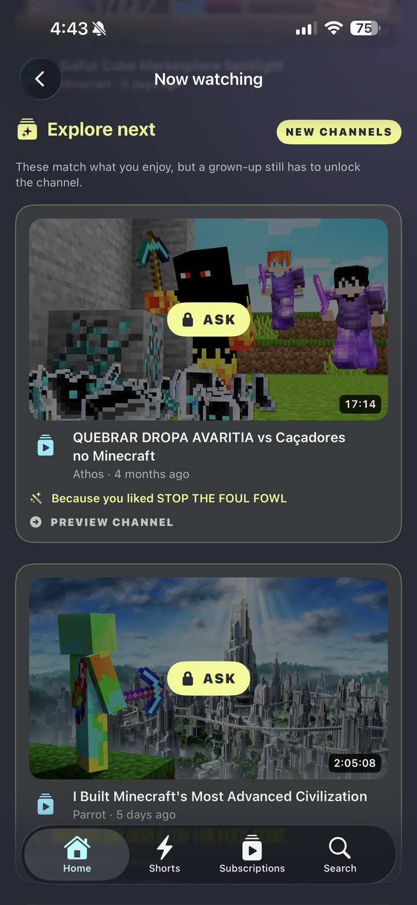
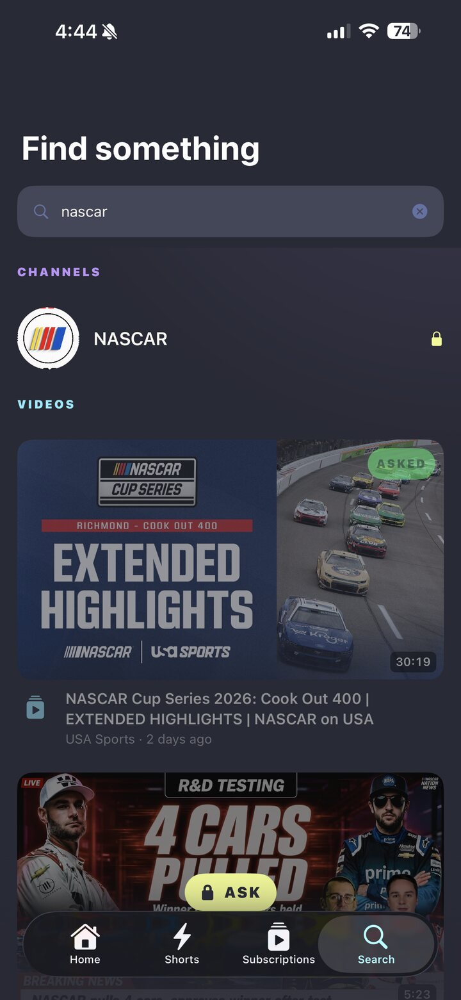
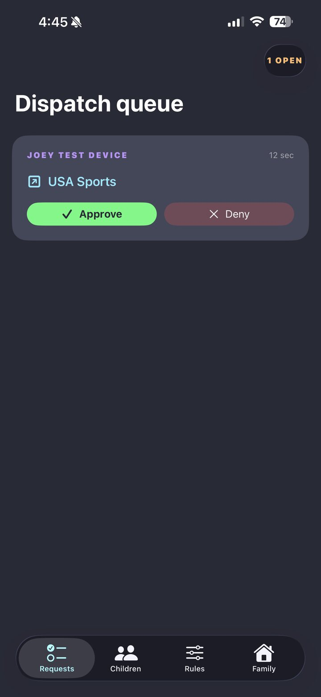
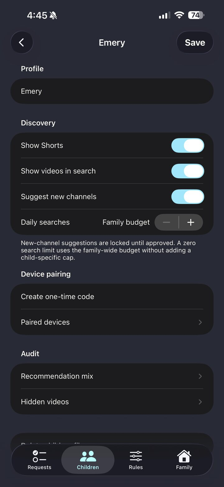
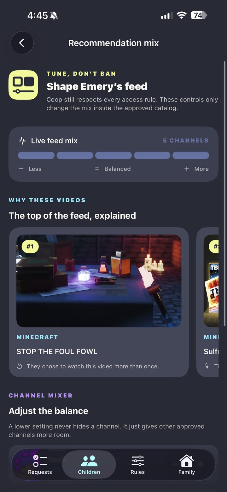
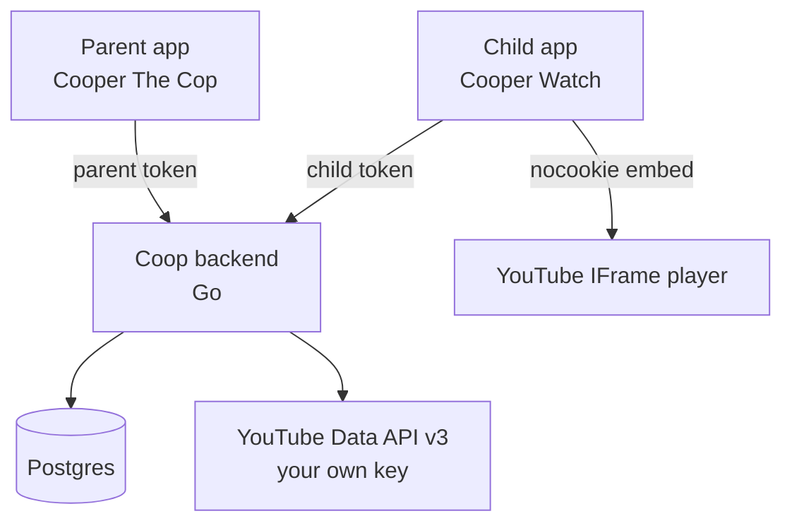

# Coop

Self-hosted, parent-curated YouTube for kids.

Children get an app that looks and feels like real YouTube: a home feed, subscriptions, channel pages, search, and a vertically scrolling Shorts feed.
Every channel they can watch was approved by a parent first.
When they find something new, they ask, and a parent approves it from their own app.

No Google account on the child's device. No comments, in either direction. No livestreams.

> **Want us to set it up?** Nerds Who Fish offers a one-time Coop setup for $500.
> You provide a computer capable of running Docker, and we'll install and configure Coop for your family.
> [Send us a message through our contact form](https://www.nerdswhofish.com/#contact) and mention Coop.

## See Coop in action

<p align="center">
  <a href="https://youtu.be/GxQG6C_B9Oc">
    
  </a>
</p>

<p align="center">
  <a href="https://youtu.be/GxQG6C_B9Oc"><strong>Watch the full Cooper The Cop demo</strong></a>
</p>

Coop keeps the YouTube experience children already understand while moving approval, policy, and recommendation controls onto a parent's device.

### Built for kids

| Watch and choose what is next | Discover safely | Search with approval built in |
| :---: | :---: | :---: |
|  |  |  |
| Familiar playback, reactions, subscriptions, and Watch Next without comments or livestreams. | New channels can still appear, but the child must ask before watching them. | Approved content plays normally while everything else stays behind a clear approval boundary. |

### Controlled by parents

| Approve from your phone | Set rules per child | Tune recommendations |
| :---: | :---: | :---: |
|  |  |  |
| Review requests and approve or deny them without touching the child's device. | Give every child their own discovery, search, Shorts, pairing, and content settings. | See why videos rank, then adjust the mix by channel instead of trusting a black-box feed. |

> **Status: ready for daily use.** The backend and both native iOS apps are complete, deployed, and ready for everyday family use.
> Production deployment, registered-device installation, backups, recovery, and child-device restrictions are documented in [the deployment guide](docs/DEPLOYMENT.md).
> The reasoning behind Coop's architectural decisions lives in [adr/](adr/).

## How it works



Each family runs their own backend with their own YouTube Data API key.
The backend holds the allowlists, evaluates policy, and caches everything it fetches.
Playback uses YouTube's official embedded player, so creators receive real views and there is no stream extraction involved.

## Features

- **Channel-level allowlists**, global across the family or per child.
- **Three channel states**: allowed, requestable (visible, asks first), and blocked (invisible).
- **Request and approve loop.** A child asks, a parent approves from their phone.
- **Negative keywords** that block individual videos inside otherwise-allowed channels, with every suppression visible to the parent and overridable in one tap.
- **Multiple children**, each with their own subscriptions, allowlist, and settings.
- **Multiple parents**, scoped to the children they are allowed to manage.
- **Local subscriptions, likes, and dislikes** that never touch YouTube.
- **No livestreams**, including finished livestream VODs.
- **Child search across channels and videos**, with blocked results hidden and requestable videos locked behind approval.
- **Opt-in new-channel discovery**, mixed conservatively into Home and Watch Next with explanations and the same approval boundary as search.
- **A shuffled, looping Shorts feed** that mounts only the visible player and never includes locked channels.
- **Parent-tunable recommendations** over the approved pool, ranked entirely from cached data.

## Components

| Path | What |
| --- | --- |
| `cmd/coopd` | The backend server binary |
| `internal/config` | Configuration loading, TOML file overlaid by environment |
| `internal/store` | Postgres models and migrations |
| `internal/policy` | Allowlist and keyword evaluation. Pure, no I/O |
| `internal/youtube` | Data API client, response cache, quota budgets |
| `internal/youtubeclient` | Family-scoped YouTube client construction |
| `internal/ingest` | Scheduled approved-channel catalog refresh |
| `internal/cleanup` | Daily expiry and ledger cleanup |
| `internal/rank` | Recommendation scoring. Pure, no I/O |
| `api/openapi.yaml` | The API contract, source of truth for both clients |
| `ios/CoopKit` | Generated Swift API client and shared native code |
| `ios/CooperTheCop` | SwiftUI parent app and XcodeGen project source |
| `ios/CooperWatch` | SwiftUI child app and XcodeGen project source |
| `adr/` | Architecture decision records |
| `docs/DEPLOYMENT.md` | Production setup, device restrictions, recovery, and operations |
| `deploy/ota` | Registered-device Ad Hoc builds and the local HTTPS install portal |

The parent app (`Cooper The Cop`) includes setup, policy administration, retained audit history, account deletion, and the recommendation mixer.
The child app (`Cooper Watch`) includes pairing, feeds, subscriptions, search, approvals, playback, reactions, sharing, and Shorts.

Coop is ready for daily family use through its self-hosted deployment and registered-device release tooling.
App Store publication still depends on the legal, content-rights, signing, account, metadata, and human approval gates listed in [ios/AppStore/README.md](ios/AppStore/README.md).

## Requirements

- Go 1.26 or newer
- Postgres 16 or newer
- A Google Cloud project with the YouTube Data API v3 enabled, and an API key
- Xcode 16 or newer and XcodeGen 2.46 or newer for the native apps

Child-device network filtering must allow your Coop backend and the small set of YouTube player hosts listed in [the deployment guide](docs/DEPLOYMENT.md#4-restrict-the-child-device).

Every family needs their own API key.
The YouTube API Developer Policies forbid embedding API credentials in open source projects, so there is no shared key and there never will be.
The upside is that each family gets its own full daily quota.

## Development

```sh
make help          # list targets
make dev-db        # start a local Postgres in Docker
make migrate       # apply migrations
make run           # run the server
make test          # run tests
make lint          # vet and staticcheck
```

The shared Swift package and native apps can be checked independently:

```sh
swift test --package-path ios/CoopKit
xcodegen generate --spec ios/CooperTheCop/project.yml
xcodebuild -skipPackagePluginValidation \
  -project ios/CooperTheCop/CooperTheCop.xcodeproj \
  -scheme CooperTheCop -destination 'generic/platform=iOS Simulator' build \
  CODE_SIGNING_ALLOWED=NO
xcodegen generate --spec ios/CooperWatch/project.yml
xcodebuild -skipPackagePluginValidation \
  -project ios/CooperWatch/CooperWatch.xcodeproj \
  -scheme CooperWatch -destination 'generic/platform=iOS Simulator' build \
  CODE_SIGNING_ALLOWED=NO
```

Build both registered-device Ad Hoc packages with `scripts/ota.sh build` after configuring `deploy/ota/.env`.
The server's optional `/install/` portal and persistent package storage are documented in [deploy/ota/README.md](deploy/ota/README.md).

## Contributing

Decisions with real trade-offs get an ADR in [adr/](adr/) before the code lands.
Prose in this repo is written one sentence per line, so that editing a sentence produces a one-line diff.

## License

MIT. See [LICENSE](LICENSE).
