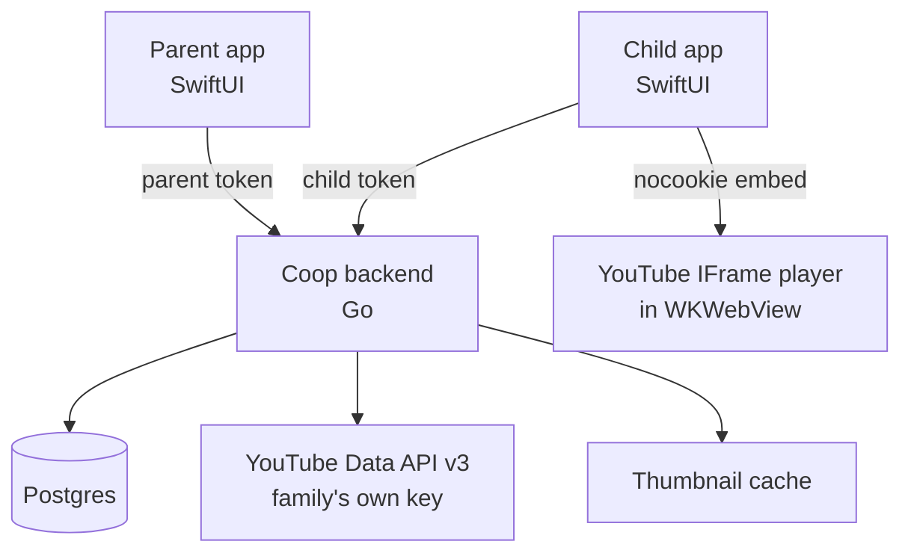
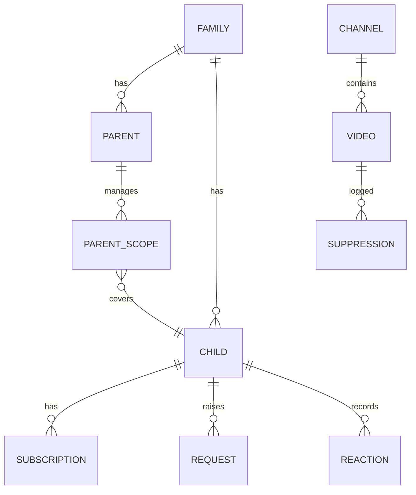

# Coop: Self-Hosted Parent-Curated YouTube

Status: plan, revision 4
Target: Go backend plus two native Swift apps (parent, child), self-hosted by each family

---

## 1. Name

**Coop.** Mascot and logo: **Cooper**, a chicken cop.

A coop is an enclosed safe space you let the birds out of on purpose, which is the product thesis.
Cooper gives the child app a friendly face for empty states, approval confirmations, and error screens.

Module path: `github.com/nerdswhofish/coop`.

App Store listings:

- Parent app: **Cooper The Cop**
- Child app: **Cooper Watch**

Apple Guideline 2.3.8 reserves the literal strings "For Kids" and "For Children" for the Kids Category, which Coop deliberately does not join (see §10).
Neither name goes near that.

---

## 2. Scope

### In

- Go backend, self-hosted, single binary plus Docker image.
- Native SwiftUI **parent app** and **child app**, two separate App Store listings.
- Child app modeled closely on real YouTube: home feed, subscriptions, channel pages, search, watch page, vertically scrolling Shorts.
- Local subscriptions, no Google account on the child device.
- Local likes and dislikes, stored in Coop, never written to YouTube.
- Sharing: a child can share a real YouTube link out to Messages.
- Three-state channel model: allowed, requestable, blocked.
- Global allowlist plus per-child allowlist, with per-child deny override.
- Negative keywords blocking individual videos inside allowed channels, global plus per-child, additive.
- Request and approve loop.
- Multiple children, multiple parents, with parents scoped to specific children.
- Parent-visible log of keyword-suppressed videos, with one-tap override.
- Parent app deep-links every approved channel out to the real YouTube app for manual review.
- Response caching on every YouTube call, floored at one hour.
- Parent-tunable recommendations over the approved pool, ranked from cached data only (§15).

### Out for now

- Comments, never fetched, never rendered, in either direction.
- Playlists, downloads.
- YouTube Live and premieres, filtered at ingest.
- Any write action against the YouTube API (see §8).
- Push notifications. §12 records what it would take.
- Ongoing re-verification of approved channels. §14 records the residual gap.

---

## 3. Playback, and why Coop does not proxy the stream

A natural instinct is to proxy video through the backend, so that YouTube's own domains can be blocked at the network level on a child's device.
Coop does not do this, and the alternative below achieves the same goal.

### Why proxying the player fails

Proxying playback means reverse-proxying three separate things: the embed document from `youtube.com/embed`, the media segments from the `*.googlevideo.com` fleet, and the player's static assets.
That runs into four walls:

1. **Developer Policy III.I.6** forbids anyone to "modify, build upon, or block any portion or functionality of a YouTube player." Interposing a proxy on segment delivery is squarely that.
2. **III.I.5** forbids modifying or blocking advertisements. A proxy that mangles ad delivery, even accidentally, violates it.
3. **Fragility.** The `googlevideo` endpoints, URL signing, and SABR streaming change without notice. This becomes a permanent maintenance tax, and every break lands on a child who just wants to watch something.
4. **Bot detection.** Server-side fetching of media is the pattern Google fingerprints and blocks. It is what made public Invidious and Piped instances unreliable.

Stream extraction and ad-blocking are also the only categories of behaviour Google has historically enforced against.
Curation has not been targeted. Staying on the sanctioned embed keeps Coop in the safe category.

### Achieving the same result with DNS

The real requirement is that a child's device cannot reach YouTube except through Coop.
That is a DNS problem, not a proxy problem.

**Coop serves every embed from `youtube-nocookie.com`, not `youtube.com`.**
That domain exists specifically for embeds and is a distinct hostname, so it survives a block on the main one.

Rules for a child's device, on any network-level filter (Firewalla, Pi-hole, NextDNS, or equivalent):

| Host | Action | Effect |
| --- | --- | --- |
| `www.youtube.com` | block | the web client is unreachable |
| `m.youtube.com` | block | mobile web is unreachable |
| `youtubei.googleapis.com` | block | the native YouTube app's API, which stops the app working |
| `www.youtube-nocookie.com` | allow | Coop's embeds keep working |
| `*.googlevideo.com` | allow | media segments, needed by Coop and useless to the native app once its API is blocked |
| `i.ytimg.com` | optional | thumbnails, see below |

The native YouTube app cannot function without `youtubei.googleapis.com`, so allowing `googlevideo.com` costs nothing.

This pairs with device-level restriction (Screen Time on iOS) to remove the browser and block app installs.
Both layers are needed. Neither alone is sufficient.

### What Coop does proxy

**Thumbnails.** `i.ytimg.com` images are static, unsigned, and carry no player functionality, so proxying them through the backend is low-risk and buys real benefits: one less domain to allow, thumbnails cached locally, and no image request from the child device to a Google host.

The pictures go through Coop. The video comes from Google's player.

---

## 4. Architecture



The backend is the only component that holds an API key or evaluates policy.
Both apps are thin clients. The child app's only direct contact with Google is the embedded player itself.

### Why the embedded player and not a native one

A native `AVPlayer` needs a direct stream URL, which means yt-dlp-style extraction: a ToS violation, the enforced category, and a permanent fight with bot detection.

The child app hosts the official IFrame player in a `WKWebView` with native SwiftUI chrome around it.
Playback is sanctioned, creators receive real views, and there is no extraction arms race to maintain.

The cost, stated plainly: the embed serves YouTube's ads and Coop may not block them.
Shipping apps in this category state exactly this in their App Store listings and are approved, so it is a workable position.

---

## 5. Storage

**Postgres only, GORM for the data layer.**

One database, one migration set, one dialect to test.
Every realistic deployment target can run a Postgres container, so the cost to a self-hoster is one extra service rather than a blocker, and it buys real operational headroom: proper backups, connection pooling, and no file-locking problems on network-backed volumes.

One architectural rule worth holding to, because it is the thing that decays first in a GORM codebase:

**The policy engine never sees GORM.**
`internal/policy` takes plain structs and returns decisions.
It does not know what a database is, it issues no queries, and it has no `gorm.Model` anywhere in its signatures.
Everything in §7 is then testable as a pure function against a table of cases, with no fixtures and no database in the loop, which is what makes it safe to change the allowlist rules later without breaking something subtle.

Repositories in `internal/store` own GORM and hand the policy engine populated structs.
The feed query is the hot path and the place to watch for N+1s.

---

## 6. Data model



Core tables:

- `family`, one row: settings, encrypted API key, timezone.
- `parent`: credentials, role (`admin` or `parent`).
- `parent_scope`: which children a non-admin parent may manage. Admins see all.
- `child`: profile name, avatar, pairing state, per-child settings.
- `channel`: cached metadata, `fetched_at`, and a separate `uploads_fetched_at` ingest clock.
- `video`: title, description, tags, duration, `is_short`, `live_state`, `made_for_kids`, `fetched_at`.
- `allow_global`, `allow_child`, `deny_child`: the three allowlist tables.
- `block_channel`: channels invisible everywhere, which cannot be surfaced or requested.
- `keyword`: term, scope (global or child), match fields, whole-word flag.
- `video_override`: per-video allow, which un-blocks something a keyword caught.
- `subscription`: child to channel, local only.
- `reaction`: child to video, like or dislike, local only.
- `watch_event`: child, video, started at, seconds watched, completion fraction. Feeds §15.
- `request`: status pending, approved or denied, with timestamps and the deciding parent.
- `suppression`: audit log of every keyword-hidden video, for the parent view.

### Multi-parent model

Two adults in a household, or a parent granting another adult limited access, both need more than a single login.

- **Admin parent** creates the family, holds the API key, manages parents, sees everything.
- **Parent** is invited by an admin and can only see and act on the children in their `parent_scope`.
- Invitations are one-time codes with an expiry.
- Every approval and denial records which parent decided, so the audit trail survives multiple adults.

This doubles as the App Review answer in §10.

---

## 7. Policy engine

Lives in `internal/policy` as a pure function with no I/O, so it is exhaustively table-testable.

### Channel resolution, three states

```text
blocked      = channel ∈ block_channel
allowed      = ¬blocked ∧ (channel ∈ allow_global ∪ allow_child(c)) ∧ channel ∉ deny_child(c)
requestable  = ¬blocked ∧ ¬allowed
```

- **Blocked** channels are invisible. They never appear in search or anywhere else, and cannot be requested. The child has no signal the channel exists.
- **Requestable** channels appear with their real icon, name, subscriber count, and banner, plus an "Ask to watch" button. No videos are served.
- **Allowed** channels behave normally.

### Video resolution

For a video from an allowed channel, in order:

1. Fails the live check, drop. See §8: this is two conditions, not one, and catches archived stream VODs as well as live and upcoming premieres.
2. Explicit `video_override` allows it, serve, skip keyword checks.
3. Any in-scope keyword matches, suppress, log a `suppression` row, do not serve.
4. Otherwise serve.

### Keyword matching

Default match fields are **title and tags**.

Description matching exists but is **off by default**, deliberately.
YouTube descriptions are full of sponsor copy, affiliate links, and boilerplate, so matching them false-positives hard enough to make the feature feel broken.

Case-insensitive, whole-word by default, with opt-in substring mode per keyword.
Whole-word avoids blocking `gun` and killing `begun` along with it.

Per-child keywords are additive to global.

### Suppressed videos are silent

Keyword-suppressed videos are omitted from the child's feed with no placeholder.
Showing a locked tile titled "Scary Monster Compilation" defeats the point of blocking the word "scary."
The parent sees every suppression, with a one-tap override.

---

## 8. YouTube integration

### Quota, and why it cannot be bought

From Google's [quota documentation](https://developers.google.com/youtube/v3/determine_quota_cost):

> Projects that enable the YouTube Data API have a default quota allocation of 100 `search.list` calls, 100 `videos.insert` calls, and 10,000 units per day combined for all other endpoints.

Per Google Cloud project, per day:

- 10,000 units for general endpoints.
- 100 `search.list` calls in a separate bucket, 1 unit each.

**There is no paid tier.** The only path to a higher ceiling is the [Audit and Quota Extension Form](https://developers.google.com/youtube/v3/guides/quota_and_compliance_audits), a manual compliance review requiring screenshots, a video walkthrough, a call inventory, a privacy policy, and branding proof.
Reported turnaround is weeks to months. It is discretionary, frequently denied, revocable, and subject to periodic re-audit.

This is unusual enough to state twice: money does not solve it.

The saving grace is that **every family runs their own Cloud project**, which is required anyway, since Developer Policy expressly forbids embedding API credentials in open source projects.
At single-family scale, 10,000 units per day is enormous headroom.
The 100-search bucket is the only tight one, and only when several children browse hard on the same day.

### Building feeds cheaply

Never use `search.list` to build a feed.

1. **The uploads playlist ID is derivable with zero API calls.** A channel ID `UCxxxx` always maps to uploads playlist `UUxxxx`. Compute it, do not fetch it.
2. `playlistItems.list` per channel for recent uploads, 1 unit each.
3. `videos.list?part=snippet,contentDetails,status,liveStreamingDetails&id=<up to 50>` for duration, live state, made-for-kids, and tags. 1 unit per fifty.
4. Channel RSS for Shorts classification, free, see below.

Forty channels refreshed hourly is roughly 1,000 units per day, about 10% of one family's allocation.

### Caching

**Every outbound response is cached, with a hard floor of one hour, and cache hits are served without touching the API.**

This is a single layer in `internal/youtube` wrapping the client, not per-call-site logic.
Every request is keyed by endpoint plus normalized parameters, the response is stored, and nothing reaches Google if a live entry exists.
Making it one layer rather than scattered caching is what guarantees the floor actually holds, since a single uncached call site is all it takes to quietly drain the search bucket.

TTLs above the floor:

| Data | TTL | Why |
| --- | --- | --- |
| Uploads playlist ID | permanent, derived | Structurally fixed, never fetched at all |
| Channel metadata (name, avatar, banner, subs) | 30 days | Changes rarely, a stale avatar is harmless |
| Uploads list | 6 hours | Children notice when new videos are slow to appear |
| Video metadata | 30 days | Titles and durations effectively do not change |
| Channel RSS (Shorts classification) | 6 hours | Free, but still a network call worth not repeating |
| Search results | 24 hours, keyed by normalized query | Protects the 100-call bucket |
| Anything not listed | 1 hour | The floor, and the default for anything added later |

Search keys are normalized to lowercase with collapsed whitespace and trimmed, so trivially different phrasings of the same query share an entry.

Cache entries are rows in Postgres rather than in-process, so a restart does not dump the cache and re-spend quota on a cold start.
That matters more than it sounds: a crash loop with an in-memory cache can drain the entire 100-call search bucket in minutes.

WebSub push is free and instant and would replace uploads polling entirely. Noted as a v2 optimization, not v1 scope.

### Budgets and the circuit breaker

Capping calls per purpose is worth doing, and it belongs on **ingest and backfill**, not on ranking.

Ranking has no natural need for API calls.
Its candidate pool is by construction the set of videos from allowed channels, and the uploads poller has already fetched every one of those.
Giving the ranker a budget would not buy it better data. It would create a path where feed latency depends on Google being reachable, which is exactly what §15 is designed to prevent.
Budgets have a way of getting spent: once one exists in the hot path, something will eventually spend it there.

Where a budget genuinely earns its keep is **backfill**.
When a channel is newly approved, only its recent uploads are cached. RSS carries about fifteen, and a child who loves a channel will want its back catalog.
Paging `playlistItems.list` through a two-thousand-video channel costs roughly forty calls, which is worth spending, worth capping, and worth doing in the background rather than on a feed load.

The design is a **global daily budget with per-purpose reserves and a hard circuit breaker**:

| Purpose | Reserve | Behaviour at limit |
| --- | --- | --- |
| Feed refresh (uploads polling) | Guaranteed, taken first | Never starved; this is what makes the app work |
| Search | The separate 100-call bucket | Returns cached results only |
| Backfill | ~500 calls, opportunistic | Pauses until tomorrow, resumes where it stopped |
| Ranking | Zero | Not applicable, reads local rows only |

Rules:

- Spend is **recorded in Postgres**, not in memory, so a crash loop cannot re-spend the day's allocation on every restart.
- Backfill only ever consumes what is left after the guaranteed reserves, so a large backfill can never starve the feed.
- Hitting a limit is a **hard stop for that class of work**, not a slowdown, and it resets at midnight Pacific along with the quota.
- The whole ceiling is configurable and defaults comfortably under 10,000, so a bug cannot exhaust a family's quota for the day.

That last point is the real value and is worth having regardless of backfill: a runaway loop in any call site hits a wall instead of taking the app down until midnight.

### What III.E.4.j and III.J actually require

Two Google policies are easy to misread as constraining what Coop may filter. Neither does.

**III.E.4.j**, from the [YouTube API Services Developer Policies](https://developers.google.com/youtube/terms/developer-policies):

- **What it requires:** when embedding a video that YouTube has designated Made For Kids, the embed must be configured to **turn off tracking**. It is a privacy requirement about analytics.
- **What it does not do:** it places no constraint on what an application filters, hides, blocks, or refuses to show. Coop can block anything for any reason.

**III.J** covers "Child-Directed API Clients" and requires notifying Google, complying with COPPA, serving no personalized ads, and taking **no write actions**: no uploading, commenting, or creating YouTube playlists.
Coop makes no writes at all. Likes, dislikes, and subscriptions are local rows that never touch the YouTube API, so compliance is structural rather than something to remember.

One useful side effect: made-for-kids videos have end screens, comments, and notifications disabled **by YouTube itself**, which removes the related-video leak for free.

### Shorts detection

There is no Shorts field in the Data API (open issue since 2022), and the usual duration heuristic is a guess.

**Read the channel RSS feed and let YouTube state it:**

```text
https://www.youtube.com/feeds/videos.xml?channel_id=<CHANNEL_ID>
```

Each `<entry>` carries a `<link rel="alternate">` whose href is the video's canonical URL.
If that href contains `/shorts/`, it is a Short. If it contains `/watch?v=`, it is a regular video.
This is not a heuristic. It is YouTube reporting the video's own canonical form.

Three reasons this beats duration:

1. **Correct at the boundary.** A 2:50 landscape video is not a Short, and duration alone cannot tell you that.
2. **Free.** RSS costs zero API quota, which matters given the 100-call search bucket.
3. **It is already the WebSub topic URL.** The same feed is what PubSubHubbub subscribes to, so when push replaces polling in v2 the Shorts signal comes along with no new integration.

**Limitation and fallback:** the RSS feed carries only the fifteen or so most recent uploads.
For backfill beyond that window, fall back to `duration <= 180s` and mark those rows with a lower-confidence flag.

Be precise about what that flag does and does not buy, because an earlier draft of this plan got it wrong.
The RSS window only moves **forward**: it always holds a channel's newest uploads.
A video that was already outside the window when it was backfilled will never re-enter it, so a later RSS pass cannot correct it and the duration guess is permanent for that row.

The practical consequence is a clean split.
**Every video uploaded after a channel is approved gets an authoritative classification**, because it passes through the RSS window on the way in.
Only the pre-existing back catalog carries guesses, and only for videos near the three-minute boundary.
That is an acceptable trade, and the confidence flag earns its place by making the distinction visible rather than by enabling an automatic repair that cannot happen.

If back-catalog accuracy ever matters enough, the repair is a manual reclassification pass, not a scheduled one.

Playback: Shorts play via `/embed/<videoId>`. The `/shorts/<id>` path is not embeddable.

### Live filtering needs two checks

Filtering on `snippet.liveBroadcastContent != "none"` alone is insufficient.
A **finished livestream VOD** reverts to `liveBroadcastContent == "none"` while retaining a `liveStreamingDetails` object, so it passes that check and lands in a child's feed.

The rule is therefore:

```text
drop if snippet.liveBroadcastContent != "none"
     OR liveStreamingDetails is present
```

The first catches live and upcoming premieres, the second catches archived streams.
`liveStreamingDetails` must be in the `part` list on the `videos.list` call for this to work.

---

## 9. iOS apps

Two separate App Store listings.
A single app with a "switch to parent mode" toggle is a bad idea, because the child will find it.

### Shared Swift package

`CoopKit`: API client, models, auth, shared by both apps.
The OpenAPI spec in the repo is the source of truth for the generated Swift client, and a server route contract test prevents documented operations from drifting away from the Go implementation.

### Child app

Tabs: Home, Shorts, Subscriptions, Search.

- **Home**: recent uploads from subscribed and allowed channels.
- **Subscriptions**: local subscription list, manage and unsubscribe.
- **Channel page**: allowed channels show videos; requestable channels show full branding (icon, banner, name, subscriber count) with an "Ask to watch" button.
- **Watch page**: embed, title, channel name, local like and dislike, share to Messages. No comments, no up-next into unapproved content.
- **Autoplay** is a per-child parent setting, described below.

**Search shows both channels and videos, like real YouTube.**
Results from channels that are not yet allowed render with a clear lock treatment on the thumbnail plus an "Ask" affordance, so the child immediately understands what needs approval rather than tapping into a dead end.
Blocked channels never appear at all.

### Shorts feed

- **Vertical scroll-snap**, one video per screen, exactly like real Shorts.
- **Only allowed channels.** No request buttons and no locked tiles in this surface. A wall of "request" buttons while scrolling is the fastest way to make a child hate the app.
- **Loops.** When the pool is exhausted it wraps back to already-seen videos rather than dead-ending.
- **Shuffled per session,** seeded so the order differs each time, with recently-shown videos weighted down so the same five do not repeat back to back.

On the overlay constraint: YouTube's Required Minimum Functionality forbids drawing anything in front of the player, including its controls.
This is compatible with vertical scroll-snap. A 9:16 video in a 19.5:9 phone screen leaves real estate above and below the player rect, and all Coop chrome (title, channel, like, share, progress) lives there.
The player itself stays a clean, unobstructed rectangle. The swipe gesture is captured by the surrounding scroll container, not by an overlay on the player.

### Autoplay

Two different things get conflated here, and separating them is what lets Shorts work without making the watch page leak.

- **Auto-load** is the iframe mounting and contacting Google at all.
- **Autoplay** is the video starting once it has loaded.

**Watch page.** Default is a local thumbnail with a play button, and nothing contacts Google until the child taps.
A per-child parent setting flips this to load-and-play on open.
The setting exists because children dislike the extra tap, and that trade is the parent's call rather than a decision baked into the app.

**Shorts feed.** Autoplay is the format. A Shorts feed that requires a tap per video is not a Shorts feed, so the active card always loads and plays.
This is not exposed as a setting, because turning it off would break the tab.
The parent-facing control that matters here is whether the Shorts tab exists at all for that child, which is a per-child toggle.

**Both are compatible with YouTube's rules.** Required Minimum Functionality permits autoplay with two conditions: more than half the player must be visible, and only one player per screen may autoplay.
Vertical scroll-snap satisfies both by construction, since exactly one card is fully on screen at a time.

One implementation trap worth recording now: the obvious way to make a snap feed scroll smoothly is to mount the neighbouring cards' players too.
Do not. That puts three players on screen loading simultaneously, which breaks the one-player rule and triples bandwidth on a cellular connection.
**Only the active card mounts a `WKWebView`. Neighbours render a cached thumbnail** and swap to a live player on becoming active.

### Parent app

- Pending request queue, approve or deny, with the requesting child named.
- Per-child management: subscriptions, allowlist, deny overrides, keywords, search budget.
- Global allowlist, global keywords, channel block list.
- **Suppressed videos** view with one-tap override.
- Add channels directly by search without waiting for a request.
- **Review approved channels**: every approved channel links out to `youtube.com/channel/<id>`, which opens the real YouTube app so a parent can watch the content they approved.
- Parent management: invite parents, scope them to children.

---

## 10. App Store strategy

Ship both apps in **Education or Entertainment**, age rating **4+**, and **do not opt into the Kids Category**.

This is what every shipping app in this category does, including YouTube Kids itself.
The Kids Category is opt-in ("If you want to participate…"), sticky once joined, and triggers a hard ban on third-party advertising that a YouTube embed cannot satisfy.
Staying out makes Guideline 1.3, covering ads, link-outs, and parental gates, entirely inapplicable.

### Guideline 2.1, reviewers need a working server

A self-hosted app has no server App Review can reach.
Apple's submission guidance names the escape hatch: "an active demo account **or fully-featured demo mode**."

Coop's answer is a **demo family**: a parent account and a child account on a reachable instance, pre-populated with approved channels and a pending request, so a reviewer can exercise the approve flow end to end.
The multi-parent model in §6 makes this a first-class feature rather than a review hack, since the demo parent is a scoped account that can be revoked.

A fully-offline demo mode is the fallback if a live dependency is ever objected to.

### The rejection pattern that actually bites

Not ads, and not link-outs: **intellectual property, 5.2.1 and 5.2.2.**
A kid-oriented app curating YouTube videos through the official embed was rejected for including copyrighted material it had no rights to.

The mitigation is architectural and already how Coop works: **the parent supplies every channel.**
Coop ships no curated library and no starter pack of recommended channels. It is a tool, not a catalog.

---

## 11. Deployment

An instance reachable from outside the home network raises the security bar above a LAN-only service, and that is the assumed deployment.

- Single static Go binary, multi-arch (darwin/arm64, linux/arm64, linux/amd64).
- Multi-arch container image.
- Compose file for the common case, Helm chart for Kubernetes.
- TLS terminated at the ingress, HSTS on.
- Child tokens scoped, long-lived, and revocable per device from the parent app.
- Parent auth: password plus TOTP, rate-limited, with lockout.
- API key encrypted at rest.
- Structured audit log of every policy change, retained.
- Config via environment variables plus an optional TOML file.

---

## 12. Deferred: push notifications

Not in v1. Recording the constraint so it does not have to be rediscovered.

APNs requires a certificate tied to the app's bundle ID, which the app publisher controls and a self-hosting parent does not.
So a self-hosted backend cannot send pushes to a published app without something in the middle.
The options, when it comes up:

- A stateless relay run by the publisher, carrying only an opaque device token and a badge count, with no content and no PII.
- ntfy or a Telegram bot, fully independent of the publisher, rougher to set up.
- Background-refresh polling, which lands around 15 to 30 minutes.

Until then the parent app shows a badge on foreground refresh.

---

## 13. Phases

**Phase 0, foundations.**
Repo scaffold, module path, OpenAPI spec, Postgres schema and GORM models, migrations, config, CI.
ADRs for the real decisions: embedded player versus proxying the stream, Shorts classification via channel RSS rather than duration, allowlist resolution semantics, multi-parent permission model, and mixed child search with detail hydration.

**Phase 1, backend core.**
YouTube client with caching, budgets, quota accounting, and scheduled ingest of approved channels.
New approvals are discovered by a cheap database poll without shortening the six-hour YouTube refresh interval.
Policy engine with exhaustive table-driven tests.
Auth, pairing, multi-parent scoping, full REST surface, and thumbnail proxy.
Expired operational rows are purged on startup and daily thereafter.
Child searches return channels and policy-filtered videos from one mixed search call, with complete metadata hydrated before evaluation.
Ends with a backend that is complete and exercisable via curl.

**Phase 2, parent app.**
Setup, children, parents, request queue, allowlists, keywords, suppressed videos, YouTube deep links.
Built before the child app so there is something to approve with.
Complete.

**Phase 3, child app core.**
Home, subscriptions, channel pages, search with lock treatment, watch page with embed, likes, share.
Complete.

**Phase 4, Shorts.**
Vertical scroll-snap feed with RSS-based classification, non-overlay chrome, single-player mounting, shuffle and loop, allowed channels only.
Complete.

**Phase 5, ship.**
Network and device setup docs, Google Cloud project walkthrough, demo family, container, Helm, compose, TestFlight, submission.

**Phase 6, recommendations.**
`internal/rank`, parent-tunable weights, anti-tunnel constraints, explanation strings in the parent app.
Deliberately last: `watch_event` has been collecting since Phase 1, so by the time this is built there is real history to tune against rather than guesses.

---

## 14. Known gaps

**Keyword filtering is a partial substitute for channel re-verification.**

Approving a channel approves its entire future, unseen. That is true of YouTube Kids' own approved-content mode and it is true here.
The failure mode is real: trusted children's channels have been hijacked and used to serve unrelated content, and established channels have been terminated for policy violations after years of ordinary uploads.

Negative keywords run against every new video from an allowed channel, so a channel drifting into blocked vocabulary is caught automatically.
They will not catch a channel that goes bad without changing its language.
The parent-app deep-link to real YouTube is the manual answer, and periodic review is a habit worth building rather than a feature Coop can fully automate.

**A child-privacy review is a prerequisite for App Store submission, not for building.**

COPPA's amended rule has been in force since April 2026 and requires separate verifiable parental consent for third-party disclosures.
An embedded YouTube player is a third-party disclosure, and self-hosting does not by itself settle the question, because the rule reaches services that let another party collect from children rather than only those that collect directly.

Three mitigations belong in the build regardless of how that review lands, because each is cheap and each reduces what is disclosed:

- Serve embeds from `youtube-nocookie.com`, which §3 already does for network-filtering reasons.
- **Parent-controlled autoplay, defaulting to off on the watch page.** See §9. A blanket "no autoplay" rule would break Shorts outright, which is why it is a setting rather than a policy.
- Keep all search and metadata server-side on the family's key, so only playback ever touches Google from the child device.

Sequencing: this gates **Phase 5**, not Phase 0.
The backend and both apps are worth building either way, since they are fully useful as a self-hosted tool with no App Store presence at all.

---

## 15. Recommendations

This is a **fundamentally easier problem than YouTube's**, because the hard part is already solved by §7.

YouTube's recommender has to find something good among a hundred million videos, most of them irrelevant, without knowing whether any given one is safe.
Coop's only ever ranks a few hundred videos a parent already approved.
Safety is a precondition rather than an objective, which collapses the problem from "discovery under uncertainty" to "ordering a small known-good set well." That is tractable with boring code.

### Optimize for something other than watch time

This is the whole design decision, and getting it wrong reproduces the thing parents dislike about the original.

YouTube's algorithm maximizes watch time, and the most common parent complaint about YouTube Kids is autoplay-driven binging.
A watch-time maximizer over a safe pool would produce a child who watches four hours of approved content, which is not the goal.

Coop ranks for **variety and satisfaction** instead:

- **Completion, not clicks.** A video watched to the end scores far higher than one opened and abandoned at ten seconds. Thumbnail bait scores itself down automatically.
- **Rewatches count positively.** Adult recommenders treat a rewatch as redundant. Children rewatch favourites relentlessly, and that is a genuine preference signal rather than noise.
- **Explicit signals win.** A local like outweighs any amount of inferred behaviour.
- **Recency matters** for subscribed channels, because the point of subscribing is seeing new uploads.

### Anti-tunnel guardrails

Hard constraints applied after scoring, not weights:

- No more than N consecutive videos from the same channel, defaulting to two or three.
- Every feed page reserves slots for channels the child has not watched recently, so approved-but-forgotten channels resurface.
- A long-tail slot for something approved but never watched.

Without these, any scorer converges on the one channel the child likes most, and the other forty approvals become decorative.

### Parent-tunable weights

Because the pool is parent-defined, the ranking can be parent-defined too.
A parent can weight a channel up or down without banning it: more of this, less of that.

That is something YouTube does not offer, it requires banning nothing, and it is a better tool than a blunt allowlist for the common real case, which is not "this channel is bad" but "this channel is fine in moderation and my child would watch it exclusively."

### No machine learning, deliberately

A few hundred videos per child and a few thousand watch events is nowhere near enough data to train anything, and a poorly-fit model would be worse than a tuned linear scorer while being impossible to debug.

The implementation is a weighted sum of the signals above, evaluated in `internal/rank`, pure and table-testable exactly like `internal/policy`.
Content-based similarity, if wanted later, comes from title and tag overlap plus the channel topic categories the Data API already returns. Still no training.

Federating signals across families would be a privacy decision, not a technical one.

### Explainability is a trust feature

Every recommendation carries its reason, and the parent app surfaces it: "Recommended because they finished three videos from this channel this week."

The core pitch is that a parent knows what their child is being shown and why.
An unexplainable recommender inside a parental-control app undercuts the entire product, and is also the fastest way to debug a scorer that has gone strange.

### The ranker never calls YouTube

**`internal/rank` reads only from Postgres and issues zero outbound requests.**

It ranks `video` rows the cache layer in §8 already populated, using signals (`reaction`, `watch_event`, `subscription`) that are entirely local.
There is no enrichment call, no "fetch details for the candidate set," no exceptions.

Three reasons this is a constraint rather than a happy accident:

1. **Quota.** Ranking runs on every feed load, the highest-frequency operation in the app. Any per-request API call there would exhaust the daily allocation before lunch.
2. **Latency.** A feed that waits on Google is a feed that feels broken. Reading local rows is single-digit milliseconds.
3. **Testability.** A ranker with no I/O is a pure function over a fixture set, which is what makes it safe to tune weights without fear.

If a candidate video is missing metadata the ranker wants, it ranks lower rather than triggering a fetch. The cache refresh cycle fills it in on its own schedule.

A capped ranking budget was considered and rejected in favour of putting that budget on backfill instead, where it does real work. §8 covers the reasoning and the full budget table.

### Scope note

This lands after the feed works. It is Phase 6, not Phase 1: the Home and Shorts feeds ship in reverse-chronological order first, and `watch_event` collects from day one so there is real history to rank on by the time the ranker exists.
